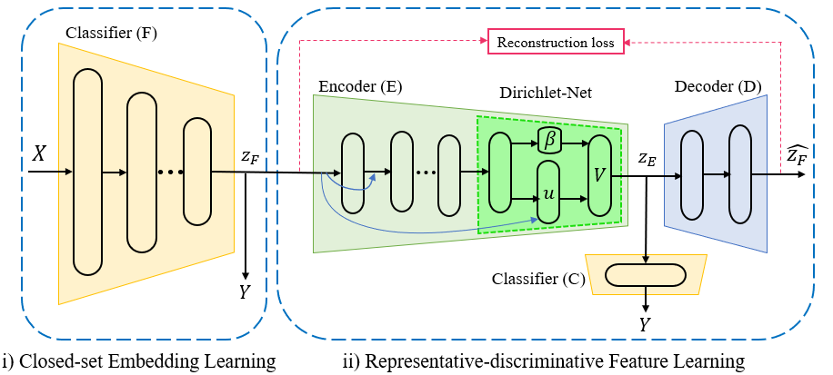

# Representative-Discriminative Open-set Recognition



This is the implementation of the following paper:

R. Kaviani Baghbaderani, Y. Qu. H. Qi, C. Stutts, [Representative-Discriminative Learning for Open-set Land Cover Classification of Satellite Imagery](https://arxiv.org/abs/2007.10891),  European Conference on Computer Vision (ECCV), 2020. [[Slides](http://web.eecs.utk.edu/~rkavian1/papers/ECCV2020-RDOSR-LongVideo.mp4)]

## Pre-requisites
* Python 3.6
* TensorFlow 1.15
* Numpy 1.19
* Scipy 1.5.1
* Scikit-learn 0.23.1

## Dataset
The code uses the following datasets:
1. Pavia University (PaviaU)
2. Pavia Center (Pavia)
3. Indian Pines (Indian_pines)

## Prepare the training dataset
To preprocess the Hyperspcetral data and divide it to Known and Unknown sets:
```python
python preprocessing.py --dataset Indian_pines --unk 3 7
```

## Training
To train the network on known set:
```python
python train_rdosr.py --dataset Indian_pines
```

## Testing
1. To test the network on a combination of known and unknown sets:
```python
python test_rdosr.py --dataset Indian_pines
```
2. Run plot_loss_accu.m  which will display the training curves.
3. Run plot_histograms_ROC.m which will display the ROC curve. 

## Contact
[Razieh Kaviani Baghbaderani](http://web.eecs.utk.edu/~rkavian1/) (rkavian1@vols.utk.edu)
